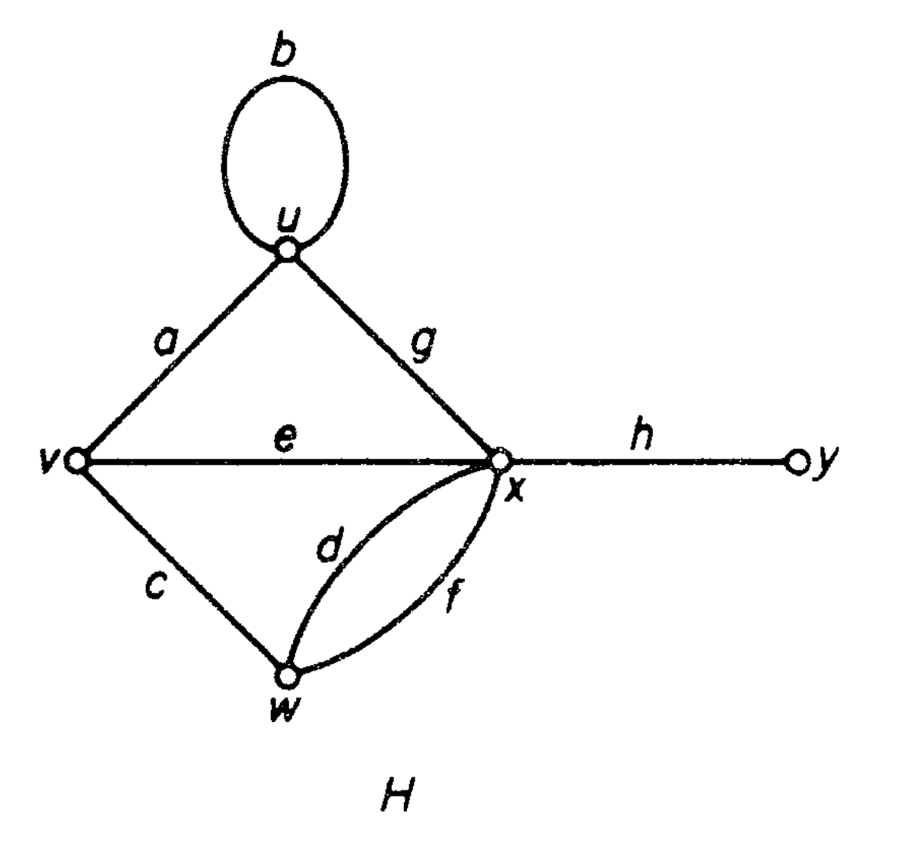

# GRAPH EMBEDDING: A Learning Journey

## 0. Preferance
This is a repository containing my learning journey of graph embedding. It mostly contain `.ipynb` file. Well, the future research of it will be implemented to a recommender system (will be discussed later).

## 1. Graph (Quick Mathematical Explanation)
A graph $G$ is an ordered triple $(V(G),E(G),\psi_{G})$ consisting of nonempty set $V(G)$ of of **vertices**, a set $E(G)$ of **edges**&mdash;disjoint of $V(G)$, and an incidence function $\psi_{G}$ that associate with each edge of $G$ an unordered **pair of (not necessarily distinct) vertices** of $G$.

*Example 1*

$$
H=(V(H),E(H),\psi_{H})
$$
where

$$
V(H) = \{u,v,w,x,y\}\\
E(H) = \{a,b,c,d,e,f,g,h\}
$$

and $\psi_{H}$ is defined by

$$
\psi_{H}(a) = uv,\psi_{H}(b) = uu,\psi_{H}(c) = vw,\psi_{H}(d) = wx  \\
\psi_{H}(e) = vx,\psi_{H}(f) = wx,\psi_{H}(g) = ux,\psi_{H}(h) = xy
$$

## 2. Graph Embedding

In the context of machine learning, an embedding is a learned representation of a set of discrete entities. An embedding maps the entities to a continuous vector space, where the distance between vectors reflects the similarity between the corresponding entities.

Embeddings are used in a variety of natural language processing tasks, such as language translation, language modeling, and text classification. They can also be used in other fields, such as recommendation systems and graph analysis.

There are two ways to embed a graph: (1) Node2Vec and (2) DeepWalk. Both of them are used for learning embeddings of nodes. The principle of both of them are generating random walks over the graph and treat each walk as a sentence. Then, they use a skip-gram model to learn the embeddings of the nodes. 

The main difference of DeepWalk and Node2Vec is that Node2Vec using 2nd order random walk. 

DeepWalk uses first-order random walks, which means that the next node in the walk is chosen based only on the current node. On the other hand, Node2Vec uses second-order random walks, which means that the next node is chosen based on the current node and the previous node.

The use of second-order random walks allows Node2Vec to capture more complex relationships between nodes in the graph. For example, if two nodes are connected by an edge with a high weight, a first-order random walk is likely to visit both nodes frequently. However, a second-order random walk is also likely to visit nodes that are farther away from the starting node, but are still connected to it through a sequence of intermediate nodes. This allows Node2vec to learn embeddings that capture higher-order structure in the graph.

## 3. Jupyter Notebook Collection

Here are some `.ipynb` files for trying the embedding learnings of nodes:

1. Zachary Karate Club Dataset

More to come...

